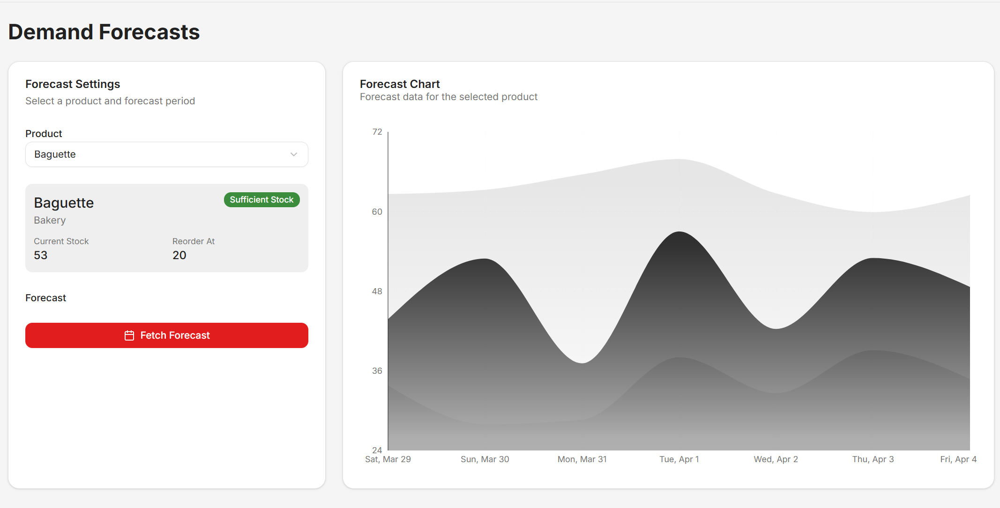
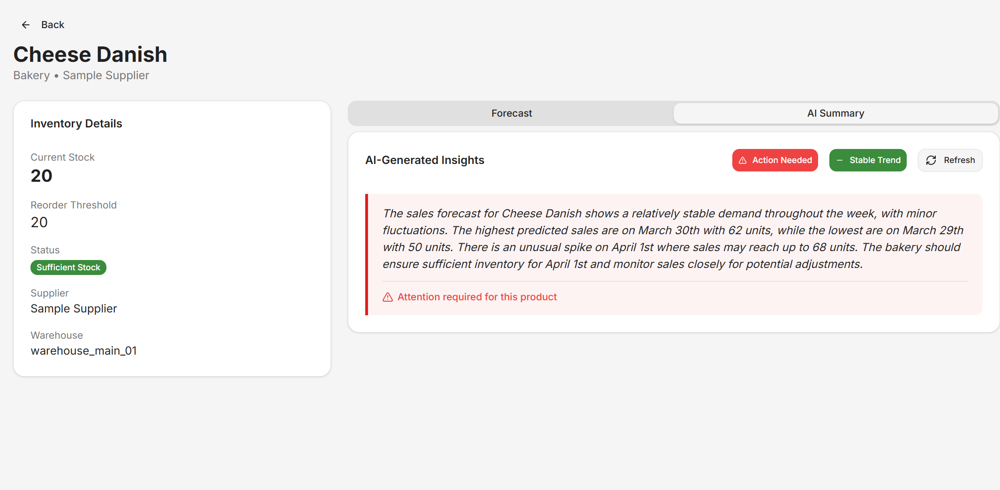
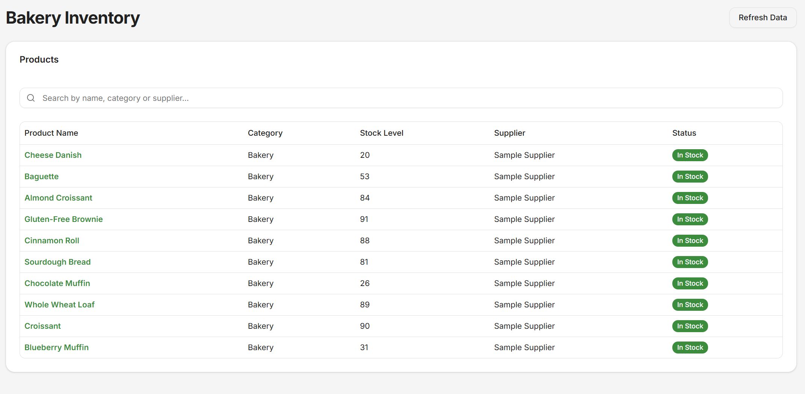
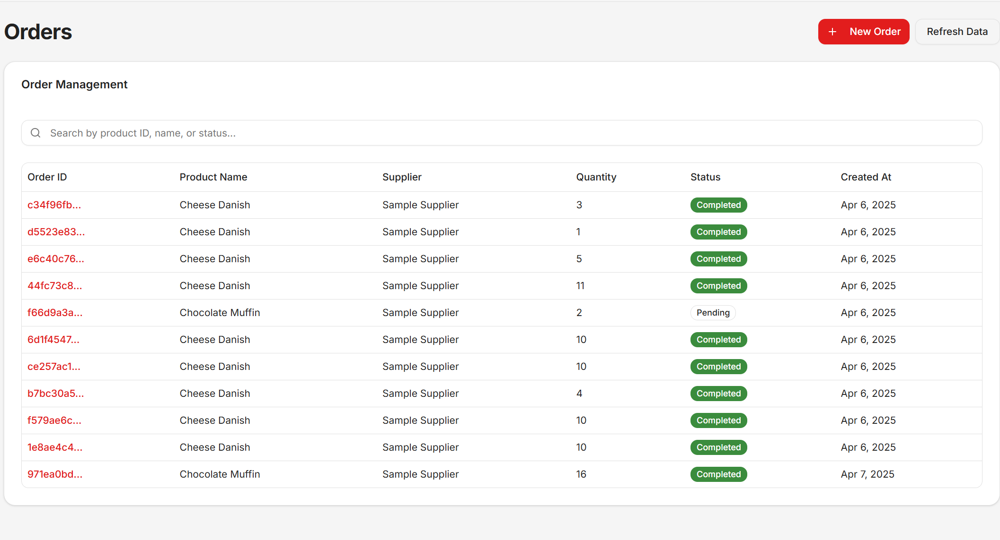
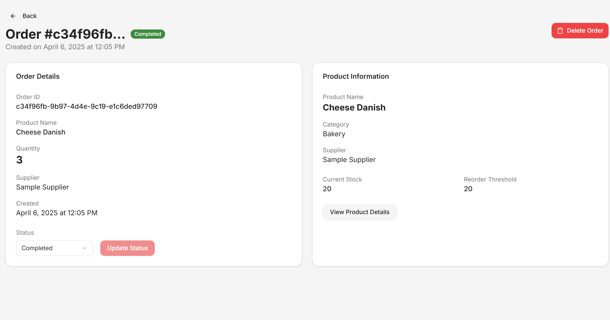

# ChainOpt AI: Supply Chain Optimizer


## Overview

ChainOpt AI is an advanced supply chain optimization system designed specifically for bakeries and food production businesses. This application leverages AI and predictive analytics to optimize inventory management, reduce waste, forecast demand, and streamline order processing.

Built with modern web technologies including Next.js, TypeScript, and AWS Amplify, ChainOpt AI provides a seamless user experience with real-time data processing and visualization.
The application is designed to be user-friendly, with a focus on providing actionable insights and recommendations to improve supply chain efficiency.

## Features

### 📊 Demand Forecasting

- AI-powered demand prediction for all products
- Interactive charts with confidence intervals
- Natural language insights on product trends
- Early warning alerts for potential stock issues

### 📦 Inventory Management

- Real-time stock level monitoring
- Automated reorder recommendations
- Product categorization and organization
- Stock level history and trend analysis

### 🛒 Order Processing

- Streamlined order creation workflow
- Order status tracking and management
- Supplier relationship management
- Order history and analytics

### 👤 User Management

- Secure authentication via AWS Cognito
- Role-based access control
- User profile management
- Session persistence and management

## Technologies

### Frontend

- **Framework**: [Next.js 15](https://nextjs.org/) with App Router
- **Language**: [TypeScript](https://www.typescriptlang.org/)
- **State Management**: [Zustand](https://github.com/pmndrs/zustand)
- **Styling**: [Tailwind CSS 4](https://tailwindcss.com/) with custom design system
- **UI Components**: Custom component library with [ShadcnUI](https://ui.shadcn.com/)
- **Notifications**: [Sonner](https://sonner.emilkowal.ski/)

### Backend Integration

- **Authentication**: [AWS Amplify](https://docs.amplify.aws/) with Cognito
- **API Management**: Custom API service with axios
- **Data Fetching**: Server-side rendering with Next.js data fetching patterns

## Project Structure

The project follows a modular architecture:

```
├── amplify/           # AWS Amplify configuration and resources
├── public/            # Static assets
├── src/
│   ├── app/           # Next.js App Router pages and layouts
│   ├── components/    # React components organized by feature
│   │   ├── dashboard/ # Dashboard specific components
│   │   ├── forecast/  # Forecasting components
│   │   ├── navigation/# Navigation components
│   │   ├── orders/    # Order management components
│   │   ├── products/  # Product management components
│   │   ├── profile/   # User profile components
│   │   └── ui/        # Reusable UI components
│   ├── hooks/         # Custom React hooks
│   ├── lib/           # Utility functions and services
│   ├── stores/        # Zustand state management
│   └── types/         # TypeScript type definitions
```

## Getting Started

### Prerequisites

- Node.js 22.x or later
- npm or yarn
- AWS account for Amplify features

### Installation

1. Clone the repository:

   ```bash
   git clone https://github.com/Jswears/supply-chain-optimizer-frontend.git
   cd supply-chain-optimizer-frontend
   ```

2. Install dependencies:

   ```bash
   npm install
   # or
   yarn install
   ```

3. Configure AWS Amplify for local development:

   ```bash
   npx ampx sandbox
   ```

4. Start the development server:

   ```bash
   npm run dev
   # or
   yarn dev
   ```

5. Open [http://localhost:3000](http://localhost:3000) to see the application

### Building for Production

```bash
npm run build
# or
yarn build
```

## Screenshots







## Architecture

ChainOpt AI follows a client-server architecture with:

- **Frontend**: Next.js React application
- **Authentication**: AWS Cognito user pools
- **API Layer**: RESTful API services
- **Data Storage**: AWS-managed database services
- **Deployment**: AWS Amplify continuous deployment

## Future Enhancements

- Multi-warehouse inventory management
- Supplier performance analytics
- Machine learning models for ingredient optimization
- Mobile application with native features
- Enhanced reporting and dashboard customization

## License

This project is proprietary and confidential. Unauthorized copying, distribution, or use is strictly prohibited.

## Contact

For more information, please contact:

- Email: [joaquinsw.salinas@gmail.com](mailto:joaquinsw.salinas@gmail.com)
- LinkedIn: [LinkedIn](https://www.linkedin.com/in/joaquin-ignacio-swears-salinas-9a4947284/)
- Portfolio: [Portfolio](https://www.joaquinswears.com/)
